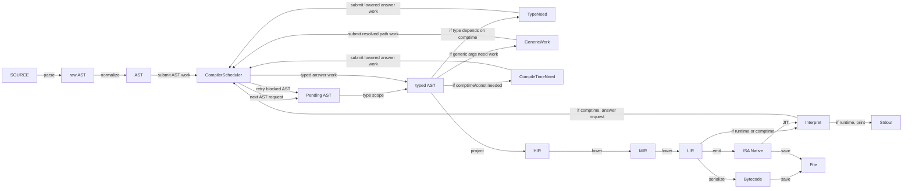

# Compiler Design

FerroPhase should be modelled as a dynamic scoped compiler, not as a fixed
linear pipeline. Source is parsed and normalized into canonical AST, then the
compiler submits AST work to a scheduler. Each work item refines a scope,
records the typed storage ids it produced, and may submit follow-up work when it
discovers generated code, missing types, deferred lowering, or compile-time
execution.

The scheduler uses a LIFO stack internally (not a FIFO queue). Independent
`submit` calls are popped in reverse submission order. Follow-up work
generated by `answer_and_schedule` is pushed in the original dependency
order. Its public role is request/answer coordination. It should be a clean
compiler component, not a 1:1 rename of the current CLI pipeline or its
stages.

This design keeps interpretation, compile-time evaluation, bytecode, native
codegen, and AST-target emission on the same semantic path. A mode changes the
required final outputs; it should not introduce a separate language
semantics.

## Full Work Path

This graph shows the full work path when each work item can make progress. It
is a work graph, not a staged pipeline. The front edge builds canonical AST.
After that, `CompilerScheduler` coordinates pending AST work, comptime
requests, identity-forming requests, lowering, execution, and emission.

Mode selection branches only after shared typed and lowered storage is
available. A branch in this graph means a consumer requested a different final
output, not that earlier semantics changed.



`Pending AST` means the pending AST scope or node that the scheduler selected
for work. `typed AST` is the same canonical AST state with type information
attached. Typing reports pending work only after the whole scope finishes. That
summary is then translated into `TypeNeed`, `GenericWork`, or
`CompileTimeNeed`.

An unresolved `TypeNeed` is not answered by a standalone type-system shortcut.
If the missing type comes from comptime, the scheduler runs the same typed AST
through HIR, MIR, LIR, and comptime execution. The interpreter answer is applied
to canonical AST or semantic state, then the blocked AST work is typed again.
The typing fan-out edges do not mean generics or comptime use a separate
compiler path. They mean typed AST may reveal a generic, unknown type, or
comptime argument that must be resolved by more work from the same scheduler
before normal lowering continues.

## Comptime Blocks

A comptime block is represented as compiler work for a work subject selected
from AST. It can interrupt the happy path at `typed AST`, but it does not start
a separate interpreter-only semantics.

When the compiler discovers a comptime block, it runs that block through the
same barebone steps as normal code: AST typing, HIR projection, MIR lowering,
LIR lowering, and execution where required.

An `Execute` request for comptime mode may answer `BlockedOnRequest` instead of
`CompileTimeValue`. This means the interpreter discovered a nested comptime or
const dependency. The scheduler records the blocked request, queues the
dependency, and retries the original `Execute` when the dependency produces its
answer. Nested comptime/const calls are therefore handled uniformly by scheduler
blocking and retry, not by recursive or private interpreter calls.

`AST` and `typed AST` are views of the same canonical AST state, not separate
program sets. If the block produces a value, generated item, or splice result,
that result is applied back to the same AST state.

An unresolved `CompileTimeNeed` cannot execute itself. If resolution needs
execution, the compiler replaces the blocked AST node with a `RequestId`,
submits the required work to `CompilerWorkScheduler`, and resumes the original
work item only when the request is answered.

Applying a result invalidates affected stored objects. The compiler then submits
follow-up `TypeJob`, `LoweringJob`, or `ExecuteJob` work for the smallest
affected blocks, functions, expressions, generated fragments, or resolved
paths. Compilation resumes from the updated state once those jobs are stable.

Needs discovered while executing comptime code are not treated differently from
needs discovered in source AST. They are represented as `CompileTimeNeed`
values, assigned `RequestId`s when they block progress, and submitted back to
the same scheduler.

Comptime async follows the same rule. `await` does not give comptime a separate
tree-walker behaviour; it requests executable scoped work and resumes through
the shared execution contract.

## Compile-Time Needs And Requests

FerroPhase comptime follows the Zig-like model: comptime can produce types,
values, declarations, and specialized code. Generics are surface syntax that can
introduce compile-time needs, but generic inference and comptime execution are
not the same operation.

A compile-time need is a request for something that must be known before the
current AST node can be typed, lowered, executed, or emitted. Inference may
satisfy ordinary generic constraints during the typing pass. If an unresolved
type depends on comptime, the compiler does not ask a separate type resolver for
the answer. It lowers the answer-producing typed AST through HIR, MIR, and LIR,
executes it in comptime mode, applies the answer, and runs typing again.

When a need blocks progress, the compiler assigns a `RequestId` and replaces the
blocked AST node with that request. The scheduler later answers the request and
the compiler applies the answer back to AST.

`FullyQualifiedPath` is the resolved semantic identity for a work subject once
identity-forming generic and comptime arguments are known:

```text
ResolvedIdentity = FullyQualifiedPath
```

Examples:

```text
Vec::<i32>      -> std::vec::Vec#{type i32}
foo(4)          -> crate::foo#{const 4}
bar::<T, 8>()   -> crate::bar#{type T, const 8}
```

Generic syntax and comptime syntax are not equivalent. Generic arguments may be
omitted or partially known and then resolved by inference. Comptime arguments
must be explicit, but can be produced by compile-time execution and can describe
more than ordinary type parameters.

Before resolution, `RequestId` names the blocked need and its source position.
Once identity-forming needs are resolved, the answer maps to the fully qualified
path for the affected item, function, block, expression, or generated fragment.
Specialization is represented by that resolved path plus its resolved arguments;
it is not a separate code-unit concept. If a const parameter can produce a
different AST shape, that parameter is encoded in the fully qualified path and
therefore participates in dependency keys and typed lowering storage ids such
as `HirId`, `MirId`, and `LirId`.

## Work Items

| Work item | Work subject | Produces |
|-----------|--------------|----------|
| Parse / normalize | file, module, quoted fragment | `RawAstId`, `AstId`, canonical AST nodes, frontend provenance |
| Type scope | item, function, block, expression | `TypedAstId`, type annotations, type constraints, diagnostics |
| Comptime / staging | const item, `const` block, splice producer | request answers, AST updates, generated declarations |
| Scoped lowering | item, function, block | `HirId`, `MirId`, `LirId` |
| Execute scope | lowered compile-time body, runtime interpreter entry | value, diagnostics, side-effect records |
| Emit output | requested target scope | `BytecodeId`, `NativeObjectId`, source, binary, metadata |
| Revalidate dependents | invalidated scope set | fresh type/lowering/execution jobs |

Work items must declare their input dependencies and produced typed storage ids.
If an input changes, the compiler invalidates dependent stored objects and
submits the smallest affected work subjects back to `CompilerWorkScheduler`.

## Migration Direction

The implementation should not migrate by renaming existing pipeline terms. A
`PipelineStage` renamed into a scheduler handler would still preserve the old
fixed ordering. The migration target is a clean `CompilerScheduler` design that
models work as requests and answers.

The old CLI pipeline can remain as an adapter while the new scheduler is built.
It should submit initial AST work and requested final outputs, then receive
answers. Over time, old stage functions can become private implementation
details behind scheduler work, and then disappear when scoped handlers are
ready.

The first useful implementation slice is:

```text
SOURCE -> raw AST -> AST -> CompilerScheduler -> typed AST -> HIR
```

After that, add blockers and answers:

```text
Pending AST -> TypeNeed or CompileTimeNeed -> RequestId -> CompilerScheduler
CompilerScheduler -> typed AST -> HIR -> MIR -> LIR -> Interpret
answer -> AST/semantic update -> blocked AST work retyped
```

Only then should runtime interpretation be moved onto the same execution path.
This avoids treating the current AST interpreter as the semantic authority while
the scheduler is still incomplete.

## Consistency Rules

- `interpret` is a compiler mode that requests executable LIR and values; it is not a
  separate AST-only semantics.
- `comptime` is the compile-time execution shorthand. It uses the same scoped
  compilation services as runtime interpretation where the constructs overlap.
- Async, `await`, intrinsic execution, panic/error flow, and side effects must
  have one semantic contract shared by interpreter and compiled modes.
- Once a construct has a lowered form, interpreter execution should reuse that
  lowered form or report the same unsupported diagnostic as compiled modes.
- Branching by target should happen at output emission time. Earlier target
  differences should be expressed as capabilities or lowering requirements on
  scheduled work items.

## Scoped Lowering

Scoped lowering is the `AST -> HIR -> MIR -> LIR` refinement for a specific
work subject. It is not a branch point. The compiler can lower a function,
const block, expression, or generated item when a consumer asks for it, then
cache the result under the subject's dependency key.

Lowering may discover that more semantic work is required. For example, a splice
producer may need compile-time execution before the surrounding function can be
fully lowered. In that case, lowering records the dependency and submits the
required staging work instead of continuing with a partial or target-specific
fallback.

## Mode Requirements

| Mode | Required final outputs |
|------|------------------------|
| Interpret | executable scopes and resulting values |
| Bytecode / text bytecode | bytecode output derived from shared lowered scopes |
| Native / LLVM / eBPF / JVM / CIL / .NET / Wasm | target output derived from shared lowered scopes |
| AST target emit | evaluated canonical AST plus target-specific surface printer output |

The scheduler can stop as soon as the requested outputs are stable. A full
native compile drains more lowering and emission work than `interpret`, but both
modes observe the same typing, staging, intrinsic, and async rules.

## Invalidation

Generated code and compile-time execution are normal mutations of the compiler
state. When they change AST or symbol state, the compiler invalidates:

- type storage for affected expressions, items, and dependent users;
- lowered HIR/MIR/LIR storage for affected scopes;
- execution results that captured stale environments;
- emitted target outputs derived from invalidated lowering.

Invalidation should prefer scope-level precision. Whole-program invalidation is
allowed as a fallback during early implementation, but it should not be the
design target.
