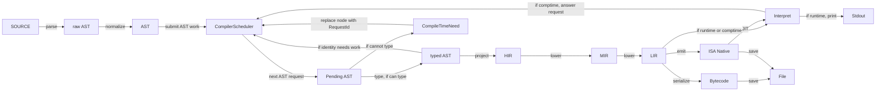

# Compiler Design

FerroPhase should be modelled as a dynamic scoped compiler, not as a fixed
linear pipeline. Source is parsed and normalized into canonical AST, then the
compiler submits AST work to a scheduler. Each work item refines a scope,
records the artefacts it produced, and may submit follow-up work when it
discovers generated code, missing types, deferred lowering, or compile-time
execution.

The scheduler may use a stack internally, but its public role is
request/answer coordination. It should be a clean compiler component, not a
1:1 rename of the current CLI pipeline or its stages.

This design keeps interpretation, compile-time evaluation, bytecode, native
codegen, and AST-target emission on the same semantic path. A mode changes the
required final artefacts; it should not introduce a separate language
semantics.

## Full Work Path

This graph shows the full work path when each unit can make progress. It is a
work graph, not a staged pipeline. The front edge builds canonical AST. After
that, `CompilerScheduler` coordinates pending AST work, comptime requests,
generic identity work, lowering, execution, and emission.

Mode selection branches only after shared typed and lowered artefacts are
available. A branch in this graph means a consumer requested a different final
artefact, not that earlier semantics changed.



`Pending AST` means the pending AST scope or node that the scheduler selected
for work. `typed AST` is the same canonical AST state with type information
attached. `CompileTimeNeed` is the blocked point where typing cannot continue
until a request is answered.

The `typed AST --> if identity needs work` edge does not mean generics use a
separate compiler path. It means typed AST may reveal a generic or comptime
identity that requires more work from the same scheduler.

## Comptime Blocks

A comptime block is represented as compiler work for a concrete block,
function, or specialization. It can interrupt the happy path at `typed AST`,
but it does not start a separate interpreter-only semantics.

When the compiler discovers a comptime block, it runs that block through the
same barebone steps as normal code: AST typing, HIR projection, MIR lowering,
LIR lowering, and execution where required.

`AST` and `typed AST` are views of the same canonical AST state, not separate
program sets. If the block produces a value, generated item, or splice result,
that result is applied back to the same AST state.

An unresolved `CompileTimeNeed` cannot execute itself. If resolution needs
execution, the compiler replaces the blocked AST node with a `RequestId`,
submits the required work to `CompilerWorkScheduler`, and resumes the original
work item only when the request is answered.

Applying a result invalidates affected artefacts. The compiler then submits
follow-up `TypeJob`, `LoweringJob`, or `ExecuteJob` work for the smallest
affected blocks, functions, or specializations. Compilation resumes from the
updated state once those jobs are stable.

Needs discovered while executing comptime code are not treated differently from
needs discovered in source AST. They are represented as `CompileTimeNeed`
values, assigned `RequestId`s when they block progress, and submitted back to
the same scheduler.

Comptime async follows the same rule. `await` does not give comptime a separate
tree-walker behaviour; it requests executable scoped work and resumes through
the shared execution contract.

## Compile-Time Needs And Requests

FerroPhase comptime follows the Zig-like model: comptime can produce types,
values, declarations, and specialized code. Generics are surface syntax that can
introduce compile-time needs, but generic inference and comptime execution are
not the same operation.

A compile-time need is a request for something that must be known before the
current AST node can be typed, lowered, executed, or emitted. Inference may
satisfy type-level parts of the need. Comptime execution may satisfy value,
type, code, or declaration parts of the need.

When a need blocks progress, the compiler assigns a `RequestId` and replaces the
blocked AST node with that request. The scheduler later answers the request and
the compiler applies the answer back to AST.

`FullyQualifiedPath` is the resolved identity. It already contains resolved
generic and comptime arguments that affect identity:

```text
ResolvedIdentity = FullyQualifiedPath
```

Examples:

```text
Vec::<i32>      -> std::vec::Vec#{type i32}
foo(4)          -> crate::foo#{const 4}
bar::<T, 8>()   -> crate::bar#{type T, const 8}
```

Generic syntax and comptime syntax are not equivalent. Generic arguments may be
omitted or partially known and then resolved by inference. Comptime arguments
must be explicit, but can be produced by compile-time execution and can describe
more than ordinary type parameters.

Before resolution, `RequestId` names the blocked need and its source position.
Once identity-forming needs are resolved, the answer maps to the fully qualified
path for the concrete block, function, or item. Specialization belongs to that
resolved path, not runtime call identity. If a const parameter can produce a
different AST shape, that parameter is encoded in the fully qualified path and
therefore in the cache key, dependency key, and lowered artefact key.

## Work Items

| Work item | Scope | Produces |
|-----------|-------|----------|
| Parse / normalize | file, module, quoted fragment | canonical AST nodes and frontend provenance |
| Type scope | item, function, block, expression | type annotations, type constraints, diagnostics |
| Comptime / staging | const item, `const` block, splice producer | request answers, AST updates, generated declarations |
| Scoped lowering | item, function, block | HIR, MIR, LIR artefacts |
| Execute scope | lowered compile-time body, runtime interpreter entry | value, diagnostics, side-effect records |
| Emit artefact | requested target scope | source, bytecode, native object, binary, metadata |
| Revalidate dependents | invalidated scope set | fresh type/lowering/execution jobs |

Work items must declare their input dependencies and output artefacts. If an
input changes, the compiler invalidates dependent artefacts and submits the
smallest affected scopes back to `CompilerWorkScheduler`.

## Migration Direction

The implementation should not migrate by renaming existing pipeline terms. A
`PipelineStage` renamed into a scheduler handler would still preserve the old
fixed ordering. The migration target is a clean `CompilerScheduler` design that
models work as requests and answers.

The old CLI pipeline can remain as an adapter while the new scheduler is built.
It should submit initial AST work and requested final artefacts, then receive
answers. Over time, old stage functions can become private implementation
details behind scheduler work, and then disappear when scoped handlers are
ready.

The first useful implementation slice is:

```text
SOURCE -> raw AST -> AST -> CompilerScheduler -> typed AST -> HIR
```

After that, add blockers and answers:

```text
Pending AST -> CompileTimeNeed -> RequestId -> CompilerScheduler
CompilerScheduler -> lowered comptime work -> Interpret -> answer
answer -> AST update -> affected work resubmitted
```

Only then should runtime interpretation be moved onto the same execution path.
This avoids treating the current AST interpreter as the semantic authority while
the scheduler is still incomplete.

## Consistency Rules

- `interpret` is a compiler mode that requests execution artefacts; it is not a
  separate AST-only semantics.
- `comptime` is the compile-time execution shorthand. It uses the same scoped
  compilation services as runtime interpretation where the constructs overlap.
- Async, `await`, intrinsic execution, panic/error flow, and side effects must
  have one semantic contract shared by interpreter and compiled modes.
- Once a construct has a lowered form, interpreter execution should reuse that
  lowered form or report the same unsupported diagnostic as compiled modes.
- Branching by target should happen at artefact emission time. Earlier target
  differences should be expressed as capabilities or lowering requirements on
  scheduled work items.

## Scoped Lowering

Scoped lowering is the `AST -> HIR -> MIR -> LIR` refinement for a specific
scope. It is not a branch point. The compiler can lower a function, const block,
or generated item when a consumer asks for it, then cache the result under the
scope's dependency key.

Lowering may discover that more semantic work is required. For example, a splice
producer may need compile-time execution before the surrounding function can be
fully lowered. In that case, lowering records the dependency and submits the
required staging work instead of continuing with a partial or target-specific
fallback.

## Mode Requirements

| Mode | Required final artefacts |
|------|--------------------------|
| Interpret | executable scopes and resulting values |
| Bytecode / text bytecode | bytecode artefacts derived from shared lowered scopes |
| Native / LLVM / eBPF / JVM / CIL / .NET / Wasm | target artefacts derived from shared lowered scopes |
| AST target emit | evaluated canonical AST plus target-specific surface printer output |

The scheduler can stop as soon as the requested artefacts are stable. A full
native compile drains more lowering and emission work than `interpret`, but both
modes observe the same typing, staging, intrinsic, and async rules.

## Invalidation

Generated code and compile-time execution are normal mutations of the compiler
state. When they change AST or symbol state, the compiler invalidates:

- type artefacts for affected expressions, items, and dependent users;
- lowered HIR/MIR/LIR artefacts for affected scopes;
- execution artefacts that captured stale environments;
- emitted target artefacts derived from invalidated lowering.

Invalidation should prefer scope-level precision. Whole-program invalidation is
allowed as a fallback during early implementation, but it should not be the
design target.
