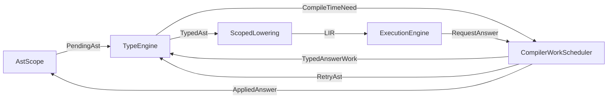

# Compile-Time Evaluation

Compile-time evaluation is not a separate AST interpreter pass. It is the
compile-time use of the same scheduler, typing, scoped lowering, and execution
services used by other modes.

A comptime construct may produce values, types, declarations, generated AST, or
specialized code. When a current work item cannot continue without one of those
results, it emits `CompileTimeNeed`. The compiler records a `RequestId`, places
that request on `CompilerWorkScheduler`, and resumes blocked work after the
answer is applied.

## Request Flow



Nested comptime uses the same graph. A comptime block that calls a const
function, instantiates a generic, awaits another comptime result, or emits code
submits more requests instead of entering a special evaluator session.

## Const Block Semantics

```rust
const RESULT: i32 = {
    let x = 10;
    let y = 20;
    x + y
};
```

- The block is represented as compiler work for a concrete AST scope.
- It is typed through `TypeEngine`.
- If executable code is needed, it is lowered through HIR, MIR, and LIR.
- `ExecutionEngine` executes the lowered artefact and returns a
  `RequestAnswer`.
- The answer is applied to the canonical AST state.

## Compile-Time Generation

Compile-time execution may synthesize runtime code based on compile-time data.
`quote`, `splice`, and `emit!` produce or apply AST-shaped answers. See
[Quoting](Quoting.md) for their surface syntax.

Generated declarations are not a second AST set. They update the canonical AST
state, then invalidate affected typed, lowered, executed, and emitted artefacts.

## Generics And Comptime

Generics and comptime can both contribute to request identity, but they remain
different language features:

- generic arguments may be inferred;
- comptime arguments must be explicitly requested by syntax or semantics;
- comptime can produce values, types, declarations, and AST fragments.

`FullyQualifiedPath` is the resolved identity and already contains resolved
generic and comptime arguments that affect identity.

If a comptime argument changes generated AST shape, it is part of the request
identity by being encoded in the fully qualified path, and therefore part of the
dependency key.

## Determinism

- Request answers must be deterministic for the same source, request identity,
  compiler options, and allowed capabilities.
- Cycles in request dependencies are compile-time errors.
- Applying an answer invalidates only dependent artefacts where possible.
- Whole-program invalidation is allowed as an implementation fallback, but not
  as the design target.

## Async

Comptime async uses the shared execution contract. `await` does not require a
tree-walker suspension implementation. It requests executable scoped work and
resumes through scheduler answers.

If async lowering or execution is unsupported for a requested mode, the compiler
should emit the same diagnostic that a compiled target would emit.

## Artefacts

With `--save-intermediates`, comptime work may contribute to:

- `.ast` canonical AST state after answers are applied;
- `.ast-typed` annotations for affected scopes;
- `.hir`, `.mir`, `.lir` for scopes lowered to execute or emit;
- target artefacts requested by the selected mode.

There is no authoritative `.ast-eval` program separate from canonical AST.

## Summary

- Comptime is scheduler work plus request answers.
- Runtime interpretation and comptime execution share lowered executable
  artefacts where constructs overlap.
- Generated code mutates canonical AST state and triggers dependency
  invalidation.
