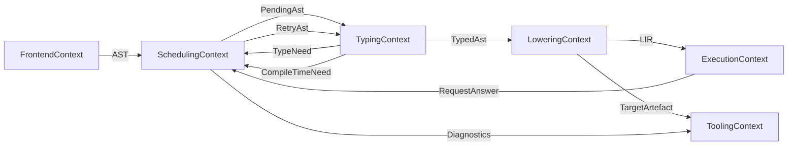

# Domain-Driven Design Lens For FerroPhase

FerroPhase is a compiler/toolchain. The domain language should describe the
intended dynamic scoped compiler, not the older fixed pipeline model.

## Ubiquitous Language

- **Work item**: A scheduled piece of compiler work, such as parsing a file,
  typing a scope, lowering a scope, executing LIR, or emitting a target.
- **Work subject**: The AST node, item, function, block, expression, generated
  fragment, or resolved path that a work item is currently about. This is not a
  code-unit abstraction.
- **Request**: A need for an artefact or answer that can block other work.
- **Request answer**: The value, type, declaration, AST edit, lowered artefact,
  or emitted output that satisfies a request.
- **Typed storage id**: Representation-specific identity for stored compiler
  data, such as `AstId`, `TypedAstId`, `HirId`, `MirId`, `LirId`,
  `ConstValueId`, `BytecodeId`, or `NativeObjectId`. These ids are storage
  handles, not specialization identity.
- **Artefact**: Persisted or emitted compiler data such as bytecode, object
  code, saved IR, or target AST output.
- **Compiler work scheduler**: The orchestrator that orders work items, records
  dependencies, and delivers request answers.
- **Compile-time need**: A value, type, declaration, code fragment, or
  identity-forming argument required before current work can continue.
- **Type need**: A typing blocker such as an unknown or unresolved type.
- **Generic work**: Scheduler work discovered by a completed typing pass for a
  generic-bearing declaration or definition whose resolved path must be
  tracked.
- **Intrinsic**: A compiler-recognized capability resolved once and consumed by
  typing, execution, and target emission.
- **Module**: The canonical unit of namespacing and compilation, rooted at a
  package path.
- **Package**: A dependency boundary that provides modules and optional
  bindings.

## Bounded Contexts

- **Frontend Context**
  - Owns parsing, frontend provenance, serializer selection, and language
    detection.
  - Produces raw AST and canonical AST.

- **Scheduling Context**
  - Owns `CompilerWorkScheduler`, request state, dependency edges,
    typed storage ids, and invalidation.
  - Does not own language semantics.

- **Typing Context**
  - Owns type inference, type queries, constraints, and typed AST annotations.
  - Produces typed scopes, `TypeNeed`, or `CompileTimeNeed`.

- **Comptime / Execution Context**
  - Owns execution of lowered LIR for comptime answers and runtime
    interpretation.
  - Produces request answers, runtime values, diagnostics, and side-effect
    records.

- **Lowering / Backend Context**
  - Owns typed AST -> HIR -> MIR -> LIR and target emission.
  - Produces typed lowering storage, bytecode, native outputs, and target AST
    output.

- **Tooling / CLI Context**
  - Owns flags, logging, saved artefacts, and user-facing diagnostics.
  - Calls domain contexts instead of embedding compiler rules.

## Aggregates And Invariants

- **Compiler session**
  - Invariants: request identity is stable; dependency edges are recorded;
    answers are applied before blocked work resumes.

- **Module**
  - Invariants: module paths resolve deterministically; exports are stable for
    bindings.

- **Package**
  - Invariants: dependency graph is valid; bindings respect declared targets.

- **Compiler object store**
  - Invariants: stored objects are keyed by typed storage id, resolved work
    subject, request identity when needed, and dependencies; invalidated objects
    are not reused.

## Domain Events

- `SourceParsed`
- `AstNormalized`
- `WorkRequested`
- `CompileTimeNeedRecorded`
- `RequestAnswered`
- `AstAnswerApplied`
- `ScopeTyped`
- `ScopeLowered`
- `ScopeExecuted`
- `TargetEmitted`
- `ArtefactInvalidated`
- `DiagnosticEmitted`

Events may occur many times in one compiler session because work is scoped and
request-driven.

## Context Map

## Refactor Guidance

1. Move orchestration into scheduler and request-state APIs.
2. Keep typing, lowering, execution, and emission semantics out of CLI code.
3. Attach diagnostics to work item identity and source spans.
4. Add invariant tests for request identity, dependency invalidation, module
   resolution, and mode consistency.
