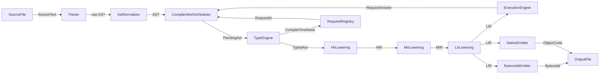

# Design Brief: Dynamic Scoped Compiler

## Overview

FerroPhase should be organized around a shared compiler state and a
`CompilerWorkScheduler`, not a fixed linear pipeline and not a separate
tree-walker interpreter semantics. Every mode asks the scheduler for the
artefacts it needs. The scheduler refines concrete scopes, records dependencies,
answers requests, and resubmits affected work when compile-time execution or
generated code changes the program state.

The source of truth is the canonical AST plus attached semantic artefacts.
Typing, compile-time execution, lowering, interpretation, bytecode, and native
emission should reuse the same scoped work model. A mode changes the requested
final artefact; it must not change language semantics.

> See also: [Compiler](Compiler.md) for the work scheduler model and
> [Glossary](Glossary.md) for shared terminology.

## Compiler Shape

The compiler arranges scheduled work as requests and answers after source has
been parsed and normalized into canonical AST. Scheduled work may type a scope,
resolve a compile-time need, lower a scope, execute lowered code, or emit a
target artefact. When work discovers a new dependency, it submits another
request instead of switching to a private control flow.



## Core Components

| Component | Responsibility |
|-----------|----------------|
| `Parser` | Parses source or generated fragments into raw AST. |
| `AstNormalizer` | Produces canonical AST and records provenance. |
| `CompilerWorkScheduler` | Owns request scheduling, dependency ordering, and answer delivery. It may use a stack internally, but it is not a renamed pipeline. |
| `RequestRegistry` | Assigns `RequestId`s, tracks blockers, and maps answers back to AST nodes. |
| `TypeEngine` | Types AST scopes, records constraints, and reports `CompileTimeNeed` when typing cannot continue. |
| `HirLowering` | Projects typed AST scopes into HIR after required semantic needs are answered. |
| `MirLowering` | Lowers HIR into MIR for optimization and control-flow structure. |
| `LirLowering` | Lowers MIR into target-neutral LIR shared by execution and emitters. |
| `ExecutionEngine` | Executes LIR for runtime interpretation, comptime answers, and JIT-backed execution when available. |
| `BytecodeEmitter` | Serializes LIR-derived bytecode. |
| `NativeEmitter` | Emits target-native object code, assembly, or backend-specific artefacts. |

## Requests And Comptime

A compile-time need is any value, type, declaration, code fragment, or
specialization identity that must be known before the current work can continue.
When a need blocks progress, the compiler replaces the blocked AST position with
a `RequestId` and submits the requested work to `CompilerWorkScheduler`.

Nested needs use the same mechanism. A comptime block that calls another const
function, instantiates a generic, or produces code does not enter a special
interpreter session. It submits more requests to the same scheduler and resumes
only after the relevant answers are applied.

`AST` and `typed AST` are states of the same canonical AST, not separate program
sets. Applying a request answer mutates or annotates the canonical AST and
invalidates only the affected typed, lowered, executed, and emitted artefacts.

## Generics And Comptime

Generics and comptime interact, but they are not the same feature.

Generic arguments may be inferred from uses. Comptime arguments must be
explicitly requested by syntax or semantics, but can compute values, types,
declarations, and AST-producing results. Both can contribute to a request
identity once the compiler knows enough AST and semantic context.

`FullyQualifiedPath` is the resolved identity and already includes resolved
generic and comptime arguments that affect identity.

Examples:

```text
Vec::<i32>      -> std::vec::Vec#{type i32}
foo(4)          -> crate::foo#{const 4}
bar::<T, 8>()   -> crate::bar#{type T, const 8}
```

If a const parameter can produce a different AST shape, that parameter is
encoded in the fully qualified path, dependency key, cache key, and lowered
artefact key. The scheduler handles this by compiling the concrete resolved
identity, not by forking a new language mode.

## Scoped Lowering

Scoped lowering is the shared `typed AST -> HIR -> MIR -> LIR` path for a
specific function, item, block, const body, or generated fragment. It is gradual:
the compiler lowers the smallest scope demanded by a consumer, caches the
result, and records dependencies.

Lowering may discover that more semantic work is required. For example, a splice
producer may need compile-time execution before the surrounding function can be
fully lowered. In that case, lowering submits the required request and stops
until the answer is available.

## Multi-Mode Support

| Mode | Requested final artefact | Shared path |
|------|--------------------------|-------------|
| Interpret | executed LIR scope and resulting values | parse, normalize, type, satisfy comptime needs, lower to executable LIR |
| Compile native / LLVM / eBPF / JVM / CIL / .NET / Wasm | target object, assembly, module, or binary | parse, normalize, type, satisfy comptime needs, scoped lowering, target emission |
| Bytecode | serialized bytecode | parse, normalize, type, satisfy comptime needs, scoped lowering, bytecode emission |
| AST target emit | evaluated canonical AST and printer output | parse, normalize, type, satisfy comptime needs, apply AST-producing answers |

Mode branching should happen at the requested artefact boundary. Earlier
differences should be represented as scheduler requests, target capabilities, or
diagnostics attached to the same semantic path.

## Intrinsic Handling

Intrinsic handling should be declarative and shared:

1. `AstNormalizer` rewrites language-specific helpers into canonical symbols.
2. Resolution maps `(symbol, target capability)` to a `ResolvedIntrinsic`.
3. `TypeEngine` uses that identity during constraint generation.
4. `ExecutionEngine` and emitters consume the same resolved identity.

An intrinsic unsupported by one mode should produce the same semantic diagnostic
as any other mode with the same missing capability. It should not silently fall
back to a different interpreter behavior.

## Async Semantics

Async support should be implemented through lowered executable artefacts, not
through explicit suspension state in a tree-walker interpreter. Comptime `await`
and runtime `await` should share one execution contract where the constructs
overlap.

If a construct has a lowered LIR form, interpretation should execute that form.
If it cannot be lowered for the requested mode, the compiler should report the
same unsupported diagnostic that compiled targets would see.

## Diagnostics And Artefacts

Diagnostics should be tied to work items, `RequestId`s, source spans, and
dependency edges. This makes errors stable even when the scheduler resumes work
in a different order.

Saving intermediates should write the artefacts that actually exist for the
requested work:

- `.ast` for canonical AST state;
- `.ast-typed` for typed AST annotations;
- `.hir`, `.mir`, and `.lir` for scoped lowered artefacts;
- `.bytecode`, `.ll`, object files, assembly, or target AST output when those
  artefacts are requested.

## Invalidation

Generated code and compile-time execution are normal mutations of compiler
state. When they change AST, symbol, or request-answer state, the compiler
invalidates:

- type artefacts for affected expressions, items, and dependent users;
- HIR, MIR, and LIR artefacts for affected scopes;
- execution artefacts that captured stale environments;
- emitted target artefacts derived from invalidated lowering.

Invalidation should prefer scope-level precision. Whole-program invalidation is
acceptable as an early fallback, but it is not the design target.

## Outstanding Design Work

1. Define concrete `CompilerWorkScheduler`, `RequestRegistry`, dependency graph,
   and artefact cache APIs.
2. Move comptime execution toward scoped lowering plus `ExecutionEngine` reuse.
3. Align interpreter mode with lowered execution so it stops owning separate
   AST-only semantics.
4. Define request identity rules for inferred generics, explicit comptime
   arguments, generated declarations, and AST-producing comptime results.
5. Extend HIR/MIR/LIR lowering to cover async, method dispatch, richer control
   flow, ownership checks, and runtime array operations.
