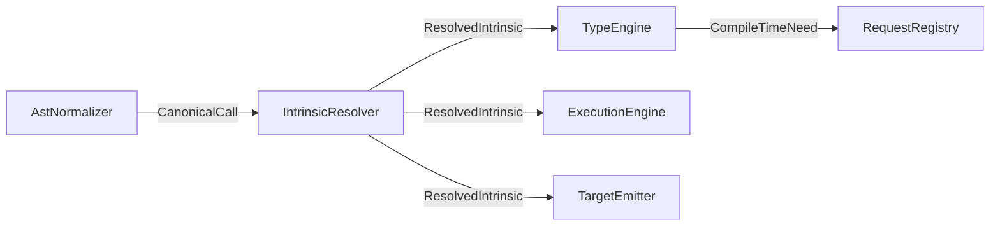

# Intrinsics

This document defines how compiler-recognized capabilities flow through the
dynamic scoped compiler.

## Terminology

- **General intrinsics**: Framework-recognized helpers such as std functions,
  helper macros, container helpers, and type utilities.
- **Strict intrinsics**: Functions under `std::intrinsic::...` that carry
  `#[lang]` items and require direct compiler support.
- **Keywords**: Staging features such as `const`, `quote`, and `splice`.
- **Builtins**: Parse-time sugar such as `emit!`; builtins lower during
  normalization and do not define new semantics.

## Core Model

Intrinsic resolution is shared by typing, execution, and emission. Frontends
normalize surface spellings into canonical symbols or intrinsic tags. The
compiler resolves those forms once, then each consumer checks the same
`ResolvedIntrinsic` against its requested capability.

## Canonical Forms

- **Canonical symbols**: `std::...` paths resolved by the intrinsic registry.
  Example: `std::type::size_of`.
- **Intrinsic tags**: AST nodes that carry explicit intrinsic meaning for
  method-style helpers or compile-time-only operations.
- **Strict symbols**: `std::intrinsic::...` `#[lang]` items used by std wrappers,
  not user code.

## Families

### Function-Style Intrinsics

Examples include `std::io::print`, `std::alloc::realloc`, and
`std::type::size_of`. They can lower to runtime calls, execute during comptime
when capability rules allow, or produce unsupported diagnostics.

### Type Utilities

Examples:

- `sizeof!` -> `std::type::size_of`
- `clone_struct!` -> `IntrinsicCallKind::CloneStruct`
- `std::intrinsic::create_struct` -> `IntrinsicCallKind::CreateStruct`
- `std::intrinsic::addfield` -> `IntrinsicCallKind::AddField`

Type utilities that need values or generated types may emit `CompileTimeNeed`
through `TypeEngine` or execution work.

### Method-Style Helpers

Examples:

- `.len()` -> `IntrinsicCallKind::Len`
- `.has_field(name)` -> `IntrinsicCallKind::HasField`
- `.field_type(name)` -> `IntrinsicCallKind::FieldType`
- `.method_count()` -> `IntrinsicCallKind::MethodCount`

After required comptime answers are applied, these either become ordinary calls,
constants, typed metadata queries, or target diagnostics.

## Scheduler Integration

1. Frontend parsing produces AST with surface spellings.
2. `AstNormalizer` rewrites spellings into canonical forms.
3. `IntrinsicResolver` produces `ResolvedIntrinsic`.
4. `TypeEngine` uses it during constraints and may emit `CompileTimeNeed`.
5. `ExecutionEngine` executes supported intrinsic behavior for comptime or
   runtime interpretation.
6. Emitters materialize remaining intrinsics for their target.

Unsupported behavior must be reported as a capability diagnostic on the same
resolved intrinsic identity. It must not silently switch to a separate
interpreter-only behavior.

## Implementation Notes

- Shared data should live under `crates/fp-core/src/intrinsics`.
- Lang items are collected from std modules before intrinsic normalization.
- `std::intrinsic` is the only home for `#[lang]` items.
- Std wrappers should call strict intrinsics; user code should use wrappers or
  general intrinsic spellings.

## Extension Checklist

1. Decide whether the intrinsic is general or strict.
2. Add or update canonical forms in the intrinsic registry.
3. Teach normalization how to rewrite surface spelling.
4. Define typing behavior and possible `CompileTimeNeed`.
5. Define execution behavior and target materialization.
6. Add tests for comptime, runtime interpretation, bytecode, and native modes
   where supported.
