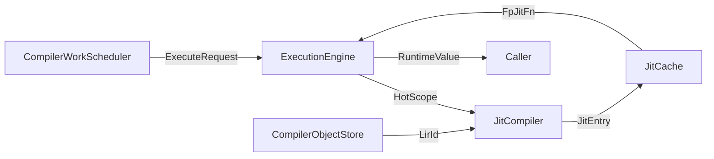

# JIT Design

## Goals

- Treat JIT as a consumer of shared lowered LIR/native objects.
- Keep interpretation, comptime execution, bytecode, and native execution on the
  same semantic path.
- Add low-latency in-process native execution for hot or requested scopes.
- Make the JIT optional and safe to disable at runtime.

## Non-Goals

- Full deoptimization support with mid-frame reconstruction.
- Aggressive speculative optimization.
- On-disk caching across runs.

## CLI Usage

```bash
fp interpret --jit path/to/main.fp
fp interpret --jit --jit-hot-threshold 64 path/to/main.fp
```

## High-Level Approach

`fp-jit` receives LIR or native-ready objects produced by scoped lowering. It
does not compile from a separate evaluated AST family and does not define
interpreter semantics.



The execution engine remains responsible for mode policy. It can execute LIR
directly, call a cached JIT entry, or request JIT compilation for a future call.

## Crate Layout

- `crates/fp-jit`
  - Owns JIT session state, code cache, symbol resolution, and ABI glue.
  - Consumes lowered LIR/native objects from backend/lowering crates.
  - Integrates with execution dispatch.

## Execution Integration

At runtime call sites:

1. Resolve the call target to a request identity.
2. Query `CompilerObjectStore` for executable LIR or native-ready objects.
3. Check `JitCache` for a compiled entry.
4. If present, invoke through the JIT ABI.
5. If absent, execute the shared LIR path and update hotness counters.
6. If hotness threshold is exceeded, enqueue JIT compilation.

The current invocation may remain interpreted; compiled code is used on a later
dispatch after the cache is populated.

## JIT ABI

The ABI bridges FerroPhase runtime values and native code:

```c
typedef struct FpValue FpValue;
typedef struct FpJitContext FpJitContext;

typedef struct {
  const FpValue *args;
  uint32_t len;
} FpJitArgs;

typedef FpValue (*FpJitFn)(FpJitContext *ctx, FpJitArgs args);
```

Notes:

- `FpValue` must be ABI-stable for the selected runtime ABI version.
- `FpJitContext` exposes runtime services such as allocation, diagnostics,
  string interning, and resolved intrinsic helpers.
- The call returns an owned `FpValue`; execution dispatch owns cleanup rules.

## Cache Key

JIT entries are keyed by the resolved fully qualified path plus ABI-relevant
type information:

```text
JitKey = FullyQualifiedPath + SignatureHash + AbiVersion + TargetFeatures
```

`FullyQualifiedPath` already includes resolved generic and comptime arguments
that affect identity. This lets generic and comptime specializations share the
compiler scheduler's dependency model.

## Safety

- JIT can be disabled by option or environment flag.
- ABI mismatches produce diagnostics and fall back to shared LIR execution when
  that mode is supported.
- Runtime faults must not silently change language semantics.

## Limitations

- Initial support may target functions only.
- Closures and captured environments need explicit ABI design.
- No speculative optimization until deoptimization exists.

## Future Work

1. Define deoptimization and OSR for hot loops.
2. Support closures and captured environments.
3. Add profile-guided inline caches for dynamic calls.
4. Persist compiled code under request/dependency keys.
