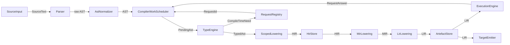

# Compiler Workflow

This file keeps the historical `Pipeline.md` name because tools and docs still
link to it. The intended design is no longer a fixed pipeline. FerroPhase should
use the dynamic scoped compiler described in [Compiler](Compiler.md): source
work, typing work, comptime work, lowering work, execution work, and emission
work are coordinated by `CompilerWorkScheduler`.

The scheduler owns ordering. Individual compiler components own semantics.

## Scheduler Overview



## Work Responsibilities

| Work | Consumes | Produces |
|------|----------|----------|
| Parse | source text, frontend choice | raw AST, provenance |
| Normalize | raw AST | canonical AST |
| Type scope | AST scope, symbol state | typed AST annotations, constraints, `CompileTimeNeed` |
| Register request | compile-time need | `RequestId`, dependency edge |
| Scoped lowering | typed AST scope | HIR, MIR, LIR artefacts |
| Execute scope | executable LIR, environment | runtime value or comptime `RequestAnswer` |
| Emit target | LIR or evaluated AST artefact | bytecode, native object, target source, metadata |
| Revalidate | changed AST or answer state | invalidated artefacts and follow-up work |

## Frontends

Frontends parse language-specific input and preserve provenance, but the shared
compiler consumes canonical AST. LAST-like frontend data may still be stored for
tooling and target emission, but it is not a semantic checkpoint in the shared
compiler design.

Shipped frontends include:

- `FerroFrontend` for FerroPhase/Rust syntax (`.fp`, `.rs`);
- `TypeScriptFrontend` for TypeScript/JavaScript families;
- `WitFrontend` for WebAssembly Interface Types;
- `SqlFrontend` for `.sql` query documents;
- `PrqlFrontend` for `.prql` query documents;
- `JsonSchemaFrontend` for validation schemas;
- `FlatbuffersFrontend` for `.fbs` type IDL.

Each frontend must document semantic degradation in
`docs/semantic/Matrix.md` when its source language cannot preserve a FerroPhase
semantic point.

## Typing And Requests

`TypeEngine` annotates canonical AST nodes in place. If it can type a scope, it
hands the typed scope to scoped lowering. If it cannot continue because a value,
type, declaration, generic identity, or generated fragment must be known first,
it emits `CompileTimeNeed`.

`RequestRegistry` assigns a `RequestId` and records the blocked AST node. The
scheduler resumes the blocked work only after an answer has been applied.

## Scoped Lowering

Scoped lowering is the shared refinement path:

```text
typed AST -> HIR -> MIR -> LIR
```

It is performed for the smallest useful scope: function, item, block, const
body, generated fragment, or requested specialization. Lowering may stop and
submit a new request if it discovers a comptime dependency.

## Modes

Modes request different final artefacts:

| Mode | Final artefact |
|------|----------------|
| `run` / `eval` | executed LIR result |
| `bytecode` | serialized bytecode |
| native / LLVM / Wasm / JVM / CIL / .NET / eBPF | target object or module |
| AST target emit | evaluated canonical AST plus target printer output |

Mode branching belongs at the artefact boundary. Typing, comptime, intrinsic
resolution, async semantics, and scoped lowering should stay shared.

## Diagnostics

Diagnostics are attached to work item identity, `RequestId`, dependency edge,
source span, and requested mode. The CLI can still print them in a familiar
order, but diagnostic ownership should follow the work that produced the error.

## Intermediates

When `--save-intermediates` is enabled, the compiler should persist artefacts
that were actually requested or produced:

- `.ast` for canonical AST state;
- `.ast-typed` for type annotations;
- `.hir`, `.mir`, `.lir` for scoped lowered artefacts;
- `.bytecode`, `.ll`, object files, assembly, or target AST output for emitted
  artefacts.

There is no separate evaluated AST family. Comptime answers are applied to the
canonical AST state and invalidate dependent artefacts.

## Error Tolerance

Error tolerance belongs to work scheduling. A work item may emit diagnostics and
produce a placeholder artefact only when the placeholder has a declared
dependency and capability contract. Fatal errors block dependent requests.

## Extending The Compiler

To add a new source language:

1. Implement `LanguageFrontend` for the language.
2. Normalize source constructs into canonical AST and canonical `std` symbols.
3. Preserve frontend provenance for diagnostics and target emission.
4. Update `docs/semantic/Matrix.md` for any semantic degradation.
5. Add scheduler tests for parse, type, comptime, lowering, and requested modes
   that the frontend supports.
