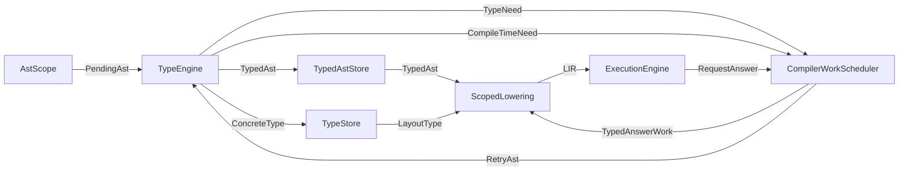

# FerroPhase Type System Overview

The FerroPhase type system annotates canonical AST state and cooperates with the
compiler scheduler. Typing is not one-way work before a separate const
evaluator. `TypeEngine` types the current scope, records constraints, and emits
`CompileTimeNeed` when a type depends on compile-time execution, generic
identity, generated declarations, or AST-producing results.

## Type Representations

- **`Ty`** - syntax-oriented type declarations attached to AST nodes before
  inference. Supports unknowns, generics, and provisional compile-time type
  tokens.
- **Typed AST annotations** - optional type fields on expressions, patterns,
  and declarations populated by `TypeEngine`.
- **`ConcreteType`** - fully resolved, layout-aware type information consumed by
  lowering, execution, emitters, tooling, and FFI adapters.
- **`IntermediateType`** - optional target adapter derived from `ConcreteType`
  when a bytecode VM, FFI boundary, or backend needs additional metadata.

## Typing Flow

`AST` and typed AST are states of the same canonical tree. Applying a request
answer may add nodes, annotate nodes, or resolve symbols, then invalidates
dependent typed and lowered storage.

## Structural And Dynamic Dictionaries

- **Structural dictionaries** are produced by comptime or intrinsic builders
  that synthesize stable record shapes. Once committed, they live in shared type
  tables as `ConcreteType` entries.
- **Dynamic dictionaries** are runtime values. They stay opaque unless a
  compile-time promotion proves a stable shape.

## Compile-Time Type Tokens

Comptime can create provisional types. `TypeEngine` records:

- the syntactic type form;
- enough metadata to emit `ConcreteType` after promotion;
- dependency edges from the producing request;
- a revision so cached queries can be invalidated.

Tokens promote atomically when the producing request succeeds. Failed requests
discard provisional entries and report diagnostics.

## Query Infrastructure

`TypeQueryEngine` exposes memoized queries over canonical AST annotations and
the committed type store:

- `expr_ty` and `pattern_ty` for tooling and lowering;
- `sizeof`, `hasfield`, trait resolution, and layout queries for intrinsics;
- capability-aware diagnostics shared by execution and emitters.

Queries observe committed request answers. If a query needs execution, it
returns or triggers `CompileTimeNeed`. If execution is required, the scheduler
lowers typed AST through HIR, MIR, and LIR before interpretation answers the
request.

## Guarantees

- **Single semantic path**: interpret, bytecode, and native modes observe the
  same type answers for covered constructs.
- **Deterministic promotions**: compile-time type-producing requests promote in
  dependency order.
- **Span fidelity**: annotations and diagnostics preserve source spans.
- **Backend isolation**: consumers read type information through stable queries,
  not raw frontend tokens.
- **Cross-IR consistency**: semantic points are preserved across typed AST, HIR,
  MIR, and LIR unless `docs/semantic/Matrix.md` declares a deviation.
- **Cross-mode consistency**: interpret, bytecode, native, and FFI modes agree
  on observable type behavior unless a declared deviation has baseline evidence.

## Future Work

1. Define the persisted encoding for `.ast-typed` artefacts.
2. Define concrete request invalidation rules for generated type declarations.
3. Extend `TypeQueryEngine` with batch operations for performance-sensitive
   intrinsics.
4. Expose request-aware type diagnostics to IDE tooling.
