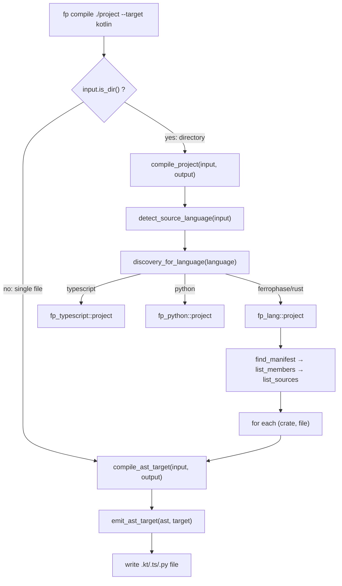

# fp-cli: Language-Agnostic Project Transpilation

## Goal

`fp compile <directory> --target kotlin` discovers a workspace, transpiles every
source file, and emits a project — with **zero language-specific code** in `fp-cli`.

## Architecture



## What changes

### 1. `fp-cli/src/languages/discovery.rs` — new file

- [x] Define `ProjectDiscovery` struct with three function pointers:
  `find_manifest`, `list_members`, `list_sources`
- [x] Define `discovery_for_language(language: &str) -> Option<&ProjectDiscovery>`
- [x] Register `fp_lang::project::*` for `"ferrophase"`/`"rust"` (always available)
- [x] Gate future languages behind `#[cfg(feature = "lang-*")]`
- [x] Register module in `languages/mod.rs`

### 2. `fp-cli/src/commands/compile.rs` — refactor

- [x] Add `compile_project(input, output, args, target)` — ~35 lines:
  1. Detect source language from input path
  2. Look up discovery functions from registry
  3. `find_manifest` → root, `list_members` → crates, `list_sources` → files
  4. For each file: `std::fs::create_dir_all(out.parent())`, call `compile_ast_target`
- [x] Delete `compile_ast_project()` — entire function (including Kotlin Gradle block)
- [x] Delete language-specific Gradle generation (Kotlin `build.gradle.kts` block)
- [x] In `compile_ast_target`: remove `if input.is_dir() → compile_ast_project` branch
  → pure single-file again
- [x] In `compile_file`: add `if input.is_dir() → compile_project` routing (with error for non-AST targets)

### 3. No changes

- [x] `fp-lang/src/project.rs` — stays exactly as-is
- [x] `fp-core` — no changes (no new traits)
- [x] `fp-cli/src/compiler.rs` — `select_frontend()` unchanged
- [x] `magnet` — already simplified, no further changes

## After

```bash
# Rust/FerroPhase projects (automatic via fp-lang)
fp compile /path/to/rust-project --target kotlin --skip-typing -o out/

# TypeScript projects (future, via fp-typescript)
fp compile /path/to/ts-project --target kotlin --skip-typing -o out/

# Python projects (future, via fp-python)
fp compile /path/to/py-project --target kotlin --skip-typing -o out/
```

`fp-cli` contains zero parser selection, zero file-extension matching, and zero
build-file generation. Each `fp-{lang}` crate owns its own discovery logic.
